# Entity Relationship & Data Model (DWOP-ERD)

## Data Model Overview & Executive Alignment

This Entity Relationship Diagram strictly reflects **Section 8 (Core Data Model)** of the AZM Nexus Engineering Implementation Directive. It provides:

1. **Strict Multi-Tenancy**: `TENANT` is the root container for all operational data, enforcing tenant isolation across all queries and services.
2. **Separation of System Identity vs. Workforce**:
   - `USER` represents system actors with login credentials (e.g., Admins, Managers, Approvers).
   - `PROFESSIONAL` represents the workforce member (candidates, contractors, interns, engineers) undergoing intake and onboarding who may not initially have system accounts.
3. **Provider Adapter Integration**: `ACCESS_REQUEST` links directly to `INTEGRATION`, decoupling third-party providers (GitHub, Trello, Slack, Google) from internal domain logic.
4. **End-to-End Governance & Audit**: Immutable `AUDIT_EVENT` and `APPROVAL_DECISION` entities guarantee verifiable compliance tracking.

---

## Mermaid Entity Relationship Diagram

```mermaid
erDiagram
    TENANT ||--o{ USER : "has identity"
    TENANT ||--o{ DEPARTMENT : "defines"
    DEPARTMENT ||--o{ TEAM : "contains"
    
    TENANT ||--o{ PROFESSIONAL : "employs workforce"
    USER ||--o| PROFESSIONAL : "maps to identity"
    PROFESSIONAL ||--o{ ENGAGEMENT : "has contracts"
    
    TENANT ||--o{ CLIENT : "services"
    CLIENT ||--o{ PROJECT : "commissions"
    PROJECT ||--o{ ASSIGNMENT : "allocates"
    PROFESSIONAL ||--o{ ASSIGNMENT : "assigned to"
    TEAM ||--o{ ASSIGNMENT : "embedded in"
    
    TENANT ||--o{ ONBOARDING_TEMPLATE : "maintains"
    ONBOARDING_TEMPLATE ||--o{ CHECKLIST_TEMPLATE_ITEM : "specifies"
    PROFESSIONAL ||--o{ ONBOARDING_RUN : "undergoes"
    ONBOARDING_TEMPLATE ||--o{ ONBOARDING_RUN : "based on"
    ONBOARDING_RUN ||--o{ ONBOARDING_ITEM : "contains"
    
    TENANT ||--o{ INTEGRATION : "configures"
    PROFESSIONAL ||--o{ ACCESS_REQUEST : "requests access"
    INTEGRATION ||--o{ ACCESS_REQUEST : "provisions through"
    ACCESS_REQUEST ||--o{ APPROVAL_DECISION : "governed by"
    
    PROFESSIONAL ||--o{ DOCUMENT_ACKNOWLEDGEMENT : "signs"
    TENANT ||--o{ NOTIFICATION : "dispatches"
    
    TENANT ||--o{ AUDIT_EVENT : "records"
    USER ||--o{ AUDIT_EVENT : "acts in"

    TENANT {
        uuid id PK
        string name
        string slug
        string domain
        string plan_tier
        jsonb branding
        timestamp created_at
    }

    USER {
        uuid id PK
        uuid tenant_id FK
        string email
        string hashed_password
        string role
        boolean is_active
        timestamp created_at
    }

    DEPARTMENT {
        uuid id PK
        uuid tenant_id FK
        string name
        uuid manager_user_id FK
        uuid parent_department_id FK
    }

    TEAM {
        uuid id PK
        uuid tenant_id FK
        uuid department_id FK
        string name
        uuid team_lead_id FK
    }

    PROFESSIONAL {
        uuid id PK
        uuid tenant_id FK
        uuid user_id FK "nullable"
        string first_name
        string last_name
        string email
        string phone
        string status "intake, onboarding, ready, assigned, offboarding, inactive"
        string availability_status
        jsonb skills
        timestamp created_at
    }

    ENGAGEMENT {
        uuid id PK
        uuid tenant_id FK
        uuid professional_id FK
        string engagement_type "employee, contractor, working_student"
        date start_date
        date end_date
        string contract_status
        string compensation_rate
    }

    CLIENT {
        uuid id PK
        uuid tenant_id FK
        string name
        string contact_email
        string status
    }

    PROJECT {
        uuid id PK
        uuid tenant_id FK
        uuid client_id FK
        string name
        string code
        string status "active, completed, on_hold"
        date start_date
        date target_end_date
    }

    ASSIGNMENT {
        uuid id PK
        uuid tenant_id FK
        uuid professional_id FK
        uuid project_id FK
        uuid team_id FK
        string role_on_project
        integer capacity_percentage
        date start_date
        date end_date
        string status "active, completed, reassigned"
    }

    ONBOARDING_TEMPLATE {
        uuid id PK
        uuid tenant_id FK
        string role_target
        string title
        string description
        integer version
        boolean is_active
    }

    CHECKLIST_TEMPLATE_ITEM {
        uuid id PK
        uuid template_id FK
        string title
        string description
        integer order_index
        string required_evidence_type
        integer default_due_days
    }

    ONBOARDING_RUN {
        uuid id PK
        uuid tenant_id FK
        uuid professional_id FK
        uuid template_id FK
        uuid assigned_manager_id FK
        string status "in_progress, blocked, completed"
        integer progress_pct
        timestamp started_at
        timestamp completed_at
    }

    ONBOARDING_ITEM {
        uuid id PK
        uuid run_id FK
        string title
        uuid owner_user_id FK
        string status "pending, blocked, completed"
        date due_date
        string blocker_reason
        string evidence_ref
        timestamp completed_at
    }

    INTEGRATION {
        uuid id PK
        uuid tenant_id FK
        string provider "github, trello, slack, google_workspace, m365"
        string auth_type "oauth2, api_key, webhook"
        string connection_status "connected, disconnected, error"
        string health_status
        jsonb credentials_encrypted
        jsonb scopes
        timestamp updated_at
    }

    ACCESS_REQUEST {
        uuid id PK
        uuid tenant_id FK
        uuid professional_id FK
        uuid integration_id FK
        string access_type "repository, channel, board, drive"
        string role_or_scope
        string status "requested, approved, provisioning, provisioned, failed, revoked"
        uuid requested_by_user_id FK
        uuid approved_by_user_id FK
        timestamp requested_at
        timestamp provisioned_at
    }

    APPROVAL_DECISION {
        uuid id PK
        uuid tenant_id FK
        string request_type "access, contract, assignment"
        uuid request_id
        uuid approver_user_id FK
        string outcome "approved, rejected"
        string rationale
        timestamp decided_at
    }

    DOCUMENT_ACKNOWLEDGEMENT {
        uuid id PK
        uuid tenant_id FK
        uuid professional_id FK
        string document_title
        string version
        string status "pending, acknowledged"
        timestamp acknowledged_at
    }

    NOTIFICATION {
        uuid id PK
        uuid tenant_id FK
        uuid recipient_user_id FK
        string channel "email, slack, in_app"
        string title
        string message
        string status "pending, sent, failed"
        timestamp sent_at
    }

    AUDIT_EVENT {
        uuid id PK
        uuid tenant_id FK
        uuid actor_user_id FK
        string action
        string target_type
        uuid target_id
        jsonb metadata
        timestamp timestamp
    }
```

---

## Domain Model Responsibilities & Next Steps

- **Backend / ORM Domain Ownership**: Khalifa (`backend/app/models/`) will translate these entities into SQLAlchemy 2.0 declarative models.
- **Provider Adapters**: Oladotun (`backend/app/integrations/`) will reference `INTEGRATION` and `ACCESS_REQUEST` entities.
- **Workflow & UAT Validation**: Walid will validate onboarding steps and approval gates against these tables.
