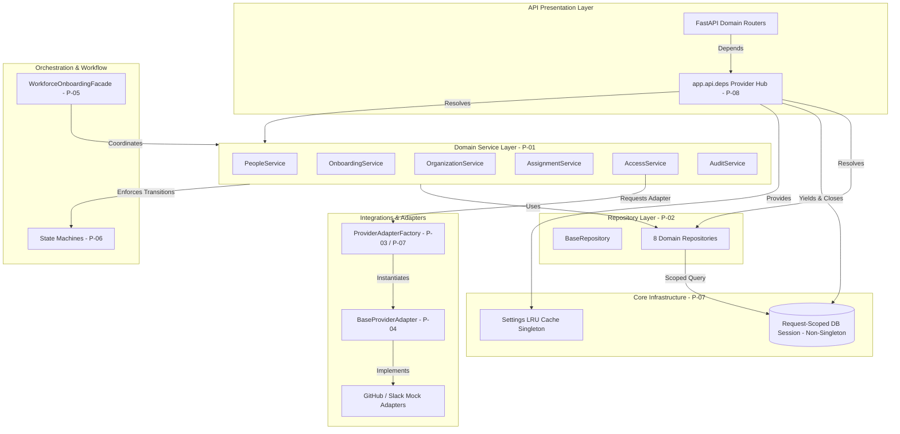
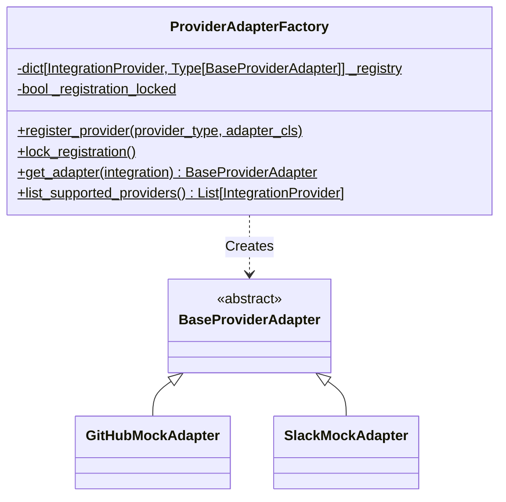
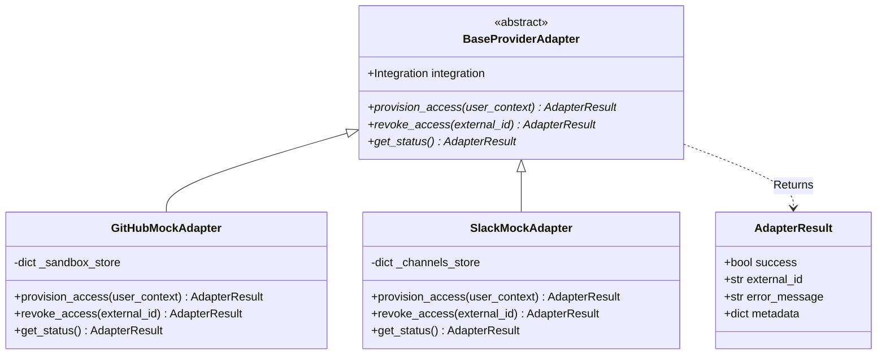
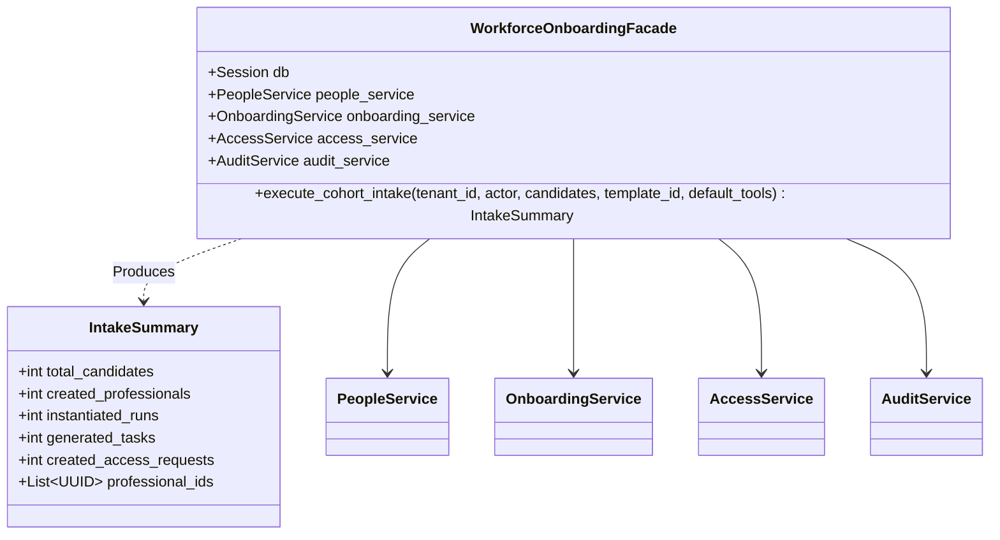
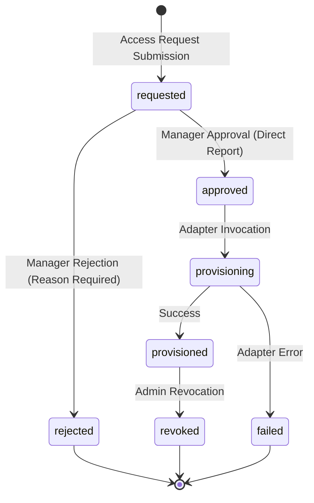
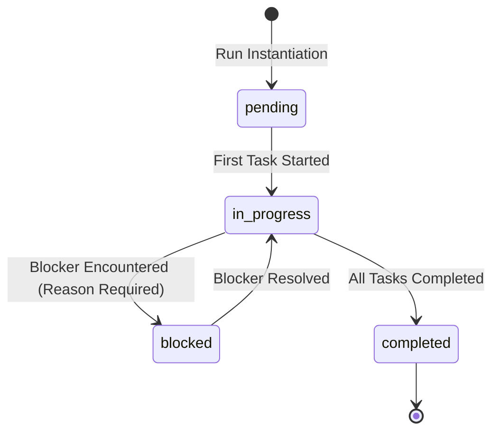
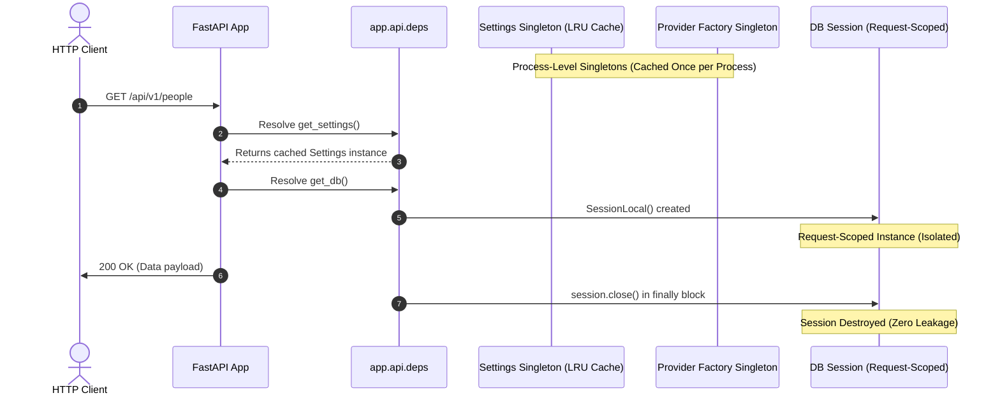
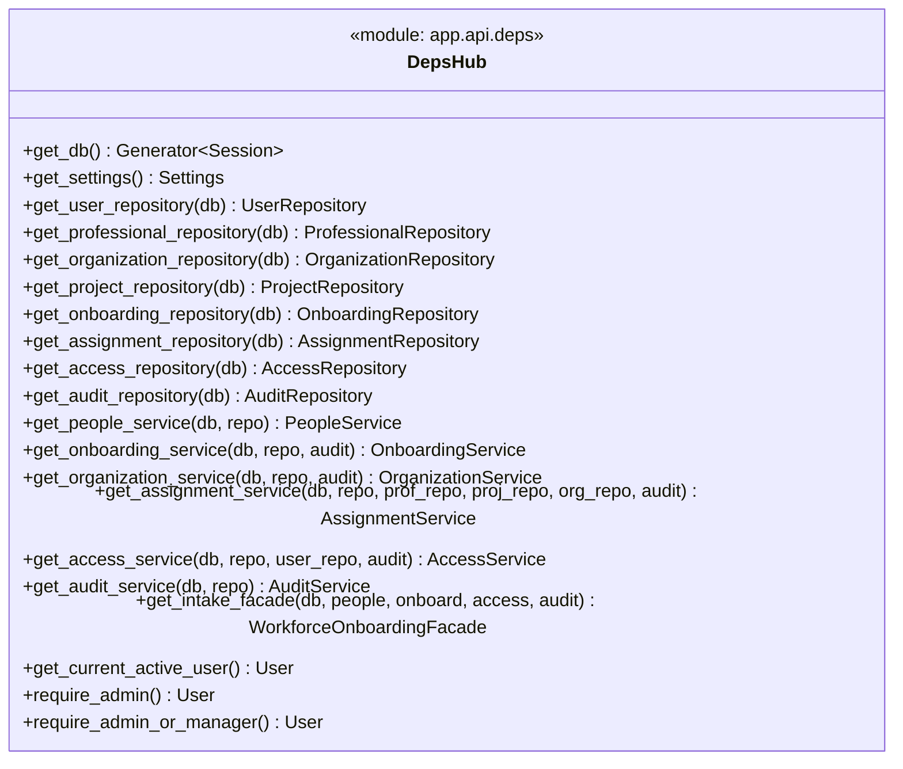

# DWOP Platform — Architectural Patterns Specification (Gate-1 Closing Deliverable)

**Document Version**: 2.0 (Phase-2 / Gate-1 Architecture Milestone Closeout)  
**Organization**: AZM Nexus Limited  
**System**: Digital Workforce Operations Platform (DWOP)  
**Author / Acting Lead**: Walid (Acting Project Lead & Core Backend Co-Dev)  
**Senior Reviewer**: Khalifa (`@KHALIFAH334`)  
**Status**: COMPLETE — Ready for CTO Phase-2 Gate-1 Sign-off  

---

## 1. Executive Summary & Gate-1 Architectural Milestone

Under the **DWOP Engineering Execution Plan (Section 3: Refactoring Blueprint — Design Patterns Applied)**, the platform engineering team has refactored the DWOP backend architecture from a rapid-prototype monolithic state into an enterprise-grade, clean architectural foundation. 

This document serves as the **official Gate-1 Closing Deliverable** submitted for CTO Phase-2 sign-off. It details all eight architectural patterns implemented across Tasks 3.1 through 3.8, including:
1. Formal intent, problem context, and design mechanics.
2. Concrete Mermaid class and lifecycle diagrams.
3. Complete file and directory registries.
4. Non-negotiable architectural invariants and guardrails.
5. An authoritative **Mandate §3 → Implemented-Code Traceability Matrix** demonstrating full compliance with executive specifications and accepted rulings.

With the completion of Task P-08, the platform test harness has expanded from 9 baseline regression suites to **14 comprehensive, automated suites**, executing 100% green with zero contract drift and zero edits to database schema models.

---

## 2. Comprehensive Architectural Patterns Registry



---

### Pattern 1: Service Layer Pattern (P-01 / Task 3.1)

#### 1.1 Intent & Problem Context
Route handlers in the initial prototype held procedural business workflows, direct database commits, and audit logging calls inline. This coupled HTTP protocol concerns (status codes, JSON serialization, headers) with domain logic, preventing reuse across CLI scripts, asynchronous workers, or facade orchestrators.

The **Service Layer Pattern** establishes a boundary where all business rules, multi-table operations, transaction boundaries, and audit logging reside inside dedicated service classes.

#### 1.2 Class Diagram

```mermaid
classDiagram
    class BaseDomainService {
        +Session db
        +commit()
        +rollback()
    }
    class PeopleService {
        +ProfessionalRepository professional_repo
        +UserRepository user_repo
        +create_person(tenant_id, payload, actor)
        +list_people(tenant_id, status_filter, availability_filter, skip, limit)
        +bulk_import(tenant_id, payload, actor)
    }
    class OnboardingService {
        +OnboardingRepository onboarding_repo
        +AuditService audit_service
        +create_template(tenant_id, payload, actor)
        +instantiate_run(tenant_id, professional_id, template_id, actor)
        +update_item(tenant_id, run_id, item_id, payload, actor)
    }
    class OrganizationService {
        +OrganizationRepository org_repo
        +create_department(tenant_id, payload, actor)
        +create_team(tenant_id, payload, actor)
    }
    class AssignmentService {
        +AssignmentRepository assignment_repo
        +ProfessionalRepository professional_repo
        +ProjectRepository project_repo
        +allocate_capacity(tenant_id, payload, actor)
        +list_assignments(tenant_id, project_id, professional_id, status_filter, skip, limit)
        +get_capacity_overview(tenant_id)
    }
    class AccessService {
        +AccessRepository access_repo
        +request_access(tenant_id, payload, actor)
        +approve_request(tenant_id, request_id, actor)
        +revoke_access(tenant_id, request_id, actor)
    }
    class AuditService {
        +AuditRepository audit_repo
        +log_event(tenant_id, action, actor_id, target_id, target_type, metadata)
        +list_events(tenant_id, action, actor_id, target_type, start_date, end_date, skip, limit)
    }

    BaseDomainService <|-- PeopleService
    BaseDomainService <|-- OnboardingService
    BaseDomainService <|-- OrganizationService
    BaseDomainService <|-- AssignmentService
    BaseDomainService <|-- AccessService
    BaseDomainService <|-- AuditService
```


#### 1.3 File Registry
- `backend/app/services/people.py`: Workforce intake, profile updates, and bulk import.
- `backend/app/services/onboarding.py`: Checklist template lifecycle, run instantiation, item transitions.
- `backend/app/services/organization.py`: Department and team hierarchy management and cycle prevention.
- `backend/app/services/assignment.py`: Capacity allocation engine, 100% threshold enforcement.
- `backend/app/services/access.py`: Tool access requests, approvals, provisioning, and revocations.
- `backend/app/services/audit.py`: Append-only immutable audit trail and security timeline.

#### 1.4 Architectural Invariants
1. **Commit & Rollback Ownership**: Services hold exclusive ownership over `db.commit()` and `db.rollback()`. Neither routers nor repositories may commit database transactions.
2. **In-Transaction Audit Emission**: Every audit event must be logged inside the same transaction block as the state mutation it records.
3. **No HTTP Coupling**: Service methods never accept `Request`, `Response`, or FastAPI `HTTPException` directly; they accept typed schemas or domain entities and raise standard exceptions.

---

### Pattern 2: Repository Pattern (P-02 / Task 3.2)

#### 2.1 Intent & Problem Context
Direct SQLAlchemy query constructions (`db.query(Entity).filter(...)`) were scattered across route handlers, introducing syntax coupling and inconsistent tenant isolation checks.

The **Repository Pattern** encapsulates data persistence behind a generic `BaseRepository[ModelType]` and 8 domain-specific repositories. Every database read and write automatically applies strict tenant filtering, preventing cross-tenant data leakage.

#### 2.2 Class Diagram

```mermaid
classDiagram
    class BaseRepository~T~ {
        +Session db
        +Type~T~ model_class
        #_scoped_query(tenant_id) Query
        +get_by_id(tenant_id, id) Optional~T~
        +list_paginated(tenant_id, skip, limit) List~T~
        +create(tenant_id, obj_in) T
        +update(tenant_id, id, obj_in) Optional~T~
        +delete(tenant_id, id) bool
    }
    class UserRepository {
        +get_by_email(email) Optional~User~
        +get_active_by_id(tenant_id, user_id) Optional~User~
    }
    class ProfessionalRepository {
        +get_by_email(tenant_id, email) Optional~Professional~
        +get_by_user_id(tenant_id, user_id) Optional~Professional~
        +list_filtered(tenant_id, status_filter, availability_filter, skip, limit)
    }
    class OrganizationRepository {
        +get_department(tenant_id, dept_id)
        +get_team(tenant_id, team_id)
        +check_hierarchy_cycle(tenant_id, dept_id, parent_id)
    }
    class ProjectRepository {
        +get_by_code(tenant_id, code)
        +list_by_client(tenant_id, client_id)
    }
    class OnboardingRepository {
        +get_template_with_items(tenant_id, template_id)
        +get_run_with_items(tenant_id, run_id)
    }
    class AssignmentRepository {
        +get_active_allocations_for_professional(tenant_id, prof_id)
        +list_assignments(tenant_id, project_id, prof_id, status, skip, limit)
    }
    class AccessRepository {
        +get_request_with_details(tenant_id, request_id)
        +list_pending_for_manager(tenant_id, manager_id)
    }
    class AuditRepository {
        +record_event(tenant_id, event_in)
        +list_events(tenant_id, filters, skip, limit)
    }

    BaseRepository <|-- UserRepository
    BaseRepository <|-- ProfessionalRepository
    BaseRepository <|-- OrganizationRepository
    BaseRepository <|-- ProjectRepository
    BaseRepository <|-- OnboardingRepository
    BaseRepository <|-- AssignmentRepository
    BaseRepository <|-- AccessRepository
    BaseRepository <|-- AuditRepository
```


#### 2.3 File Registry
- `backend/app/repositories/base.py`: Generic CRUD base with `_scoped_query(tenant_id)`.
- `backend/app/repositories/user.py`: System identity queries, authentication lookups.
- `backend/app/repositories/professional.py`: Talent directory, intake lookups, availability filters.
- `backend/app/repositories/organization.py`: Department and team lookups, hierarchy validation.
- `backend/app/repositories/project.py`: Project and client data queries.
- `backend/app/repositories/onboarding.py`: Checklists, runs, and template items.
- `backend/app/repositories/assignment.py`: Allocations, active capacity sums, assignment queries.
- `backend/app/repositories/access.py`: Access requests, credentials, provider links.
- `backend/app/repositories/audit.py`: Append-only audit record creation and timeline filters.

#### 2.4 Architectural Invariants
1. **Mandatory Tenant Scoping**: All queries constructed inside repositories derive from `self._scoped_query(tenant_id)`. Bypassing tenant filtering is prohibited.
2. **Non-Committing Persistence**: Repositories execute `self.db.add(...)` and `self.db.flush(...)`, but never invoke `self.db.commit()`. Transaction commit remains exclusive to the Service Layer.
3. **Repository Roster**: Exactly 8 domain repositories are recognized, including `OrganizationRepository` as an approved extension of the 7 originally mandated.

---

### Pattern 3: Factory Pattern (P-03 / Task 3.3)

#### 3.1 Intent & Problem Context
Integration adapters were previously created using procedural conditionals (`if provider == "github": ...`). Adding new third-party integrations required modifying core business services.

The **Factory Pattern** provides a centralized, typed registry (`ProviderAdapterFactory`) mapping `IntegrationProvider` enum values to concrete adapter classes, validating configuration and decrypting credentials before returning initialized adapters.

#### 3.2 Class Diagram


#### 3.3 File Registry
- `backend/app/integrations/factory.py`: `ProviderAdapterFactory` with thread-safe registration and post-startup lock.
- `backend/app/integrations/base.py`: Provider contract and registry initialization hooks.

#### 3.4 Architectural Invariants
1. **Single Entry Point**: All adapter instances must be resolved via `ProviderAdapterFactory.get_adapter(integration)`. Direct instantiation of adapters in service code is prohibited.
2. **Post-Startup Registration Lock**: Following application bootstrap, the factory registration dictionary is permanently locked to prevent dynamic class injection or tampering.

---

### Pattern 4: Adapter Pattern (P-04 / Task 3.4)

#### 4.1 Intent & Problem Context
Disparate third-party SaaS APIs (GitHub, Slack, Google Workspace) exhibit varying authentication headers, payload schemas, and error codes. Exposing these differences to domain services created vendor lock-in.

The **Adapter Pattern** enforces a standardized, abstract contract (`BaseProviderAdapter`) that translates vendor-specific API structures into a uniform `AdapterResult` schema.

#### 4.2 Class Diagram


#### 4.3 File Registry
- `backend/app/integrations/base.py`: `BaseProviderAdapter` abstract base class and `AdapterResult` Pydantic model.
- `backend/app/integrations/github_mock.py`: Network-isolated GitHub mock adapter with invite simulation.
- `backend/app/integrations/slack_mock.py`: Network-isolated Slack mock adapter for channel invitations.

#### 4.4 Architectural Invariants
1. **Standardized Return Types**: All adapter operations must return an immutable `AdapterResult` instance; adapters must never raise unhandled third-party client exceptions into domain services.
2. **Deterministic Network Isolation**: Mock adapters used in CI and staging must operate purely in-memory with zero external HTTP calls.

---

### Pattern 5: Facade Pattern (P-05 / Task 3.5)

#### 5.1 Intent & Problem Context
Onboarding a cohort of professionals required coordinating multiple distinct operations: creating professional records, instantiating onboarding runs with template checklist tasks, generating default access requests, and emitting aggregate audit events. Executing these across disparate endpoints risked partial failures and orphan records.

The **Facade Pattern** implements `WorkforceOnboardingFacade`, providing a high-level, atomic interface that executes multi-step workforce intake within a single database transaction.

#### 5.2 Class Diagram


#### 5.3 File Registry
- `backend/app/facades/intake.py`: `WorkforceOnboardingFacade` atomic coordinator.
- `backend/app/facades/__init__.py`: Facade exports and summary data structures.

#### 5.4 Architectural Invariants
1. **Atomic Transaction Boundary**: The entire cohort intake workflow executes within a single database transaction managed by the facade. An exception at any step triggers a full `db.rollback()`.
2. **Zero Partial Writes**: An intake operation either completely provisions all professionals, onboarding runs, and access tickets, or leaves the database in its original state.

---

### Pattern 6: State Machine Pattern (P-06 / Task 3.6)

#### 6.1 Intent & Problem Context
Status progression across onboarding runs, access tickets, checklist items, and project assignments was previously implemented with procedural `if/else` conditions. This allowed illegal state bypasses and obscured business transition requirements.

The **State Machine Pattern** centralizes lifecycle rules in deterministic state machine classes inheriting from `BaseStateMachine[StateType]`, enforcing valid transitions, terminal state immutability, and precondition guards.

#### 6.2 State Transition Graphs




#### 6.3 File Registry
- `backend/app/core/state_machines.py`:
  - `BaseStateMachine[T]`: Generic transition validation engine.
  - `AccessRequestStateMachine`: Access ticket lifecycle with `requested`, `approved`, `rejected`, `provisioning`, `provisioned`, `failed`, `revoked`.
  - `OnboardingRunStateMachine`: Onboarding journey across `pending`, `in_progress`, `blocked`, `completed`.
  - `AssignmentStateMachine`: Capacity allocations across `active`, `completed`, `reassigned`.
  - `OnboardingItemStateMachine`: Checklist tasks across `pending`, `blocked`, `completed`.
  - `TicketStateMachine`: Work management board stages across `backlog`, `todo`, `in_progress`, `blocked`, `review`, `completed`.

#### 6.4 Architectural Invariants
1. **Transition Validation**: Domain services must call `state_machine.validate_transition(current, target)` before executing status mutations.
2. **Terminal Immutability**: States defined as terminal (`completed`, `revoked`, `rejected`) can never transition to any subsequent state.
3. **Mandatory Guard Enforcements**: Specific transitions (e.g. entering `blocked` or `rejected`) strictly require attached non-empty reason strings.

---

### Pattern 7: Scoped Singleton Pattern (P-07 / Task 3.7)

#### 7.1 Intent & Problem Context
Stateless configuration parameters and provider adapter registries incurred redundant file I/O and object allocation when instantiated repeatedly. Conversely, database sessions must never be shared across concurrent web requests.

The **Scoped Singleton Pattern** applies Python's `@lru_cache` to cache application-level configuration (`get_settings()`) and locks `ProviderAdapterFactory` at process startup, while formally establishing the **Strict Non-Singleton Invariant for Database Sessions**.

#### 7.2 Lifecycle Scope Contrast


#### 7.3 File Registry
- `backend/app/core/config.py`: `@lru_cache` decorator applied to `get_settings()`.
- `backend/app/integrations/factory.py`: Process-level provider class registry with thread lock.
- `docs/architecture.md`: Section 6 defining the **Strict Non-Singleton Invariant for Database Sessions**.

#### 7.4 Architectural Invariants
1. **Process-Level Stateless Singletons**: Configuration settings and adapter registries must remain singleton-scoped and strictly stateless.
2. **Strict Non-Singleton DB Sessions**: Database sessions (`SessionLocal`) must NEVER be treated as singletons or cached across requests. Every request receives a fresh session that is guaranteed to close upon completion.

---

### Pattern 8: Dependency Injection Pattern (P-08 / Task 3.8)

#### 8.1 Intent & Problem Context
API route handlers previously constructed domain services (`PeopleService(db)`) and repositories inline within route functions. This tightly coupled endpoints to database sessions, prevented mock substitution in tests, and complicated session teardown.

The **Dependency Injection Pattern** establishes a centralized provider hub (`backend/app/api/deps.py`) using FastAPI's `Depends()` mechanism. All routers declare dependencies declaratively, enabling 100% database-free unit and integration testing via `app.dependency_overrides`.

#### 8.2 Provider Hub Structure


#### 8.3 File Registry
- `backend/app/api/deps.py`: Authoritative dependency provider hub.
- All 10 refactored domain routers:
  - `backend/app/api/auth.py`
  - `backend/app/api/people.py`
  - `backend/app/api/onboarding.py`
  - `backend/app/api/assignments.py`
  - `backend/app/api/access.py`
  - `backend/app/api/departments.py`
  - `backend/app/api/teams.py`
  - `backend/app/api/clients.py`
  - `backend/app/api/audit.py`
  - `backend/app/api/integrations.py`
- `backend/scripts/test_dwop018_dependency_injection.py`: 14th architectural test suite.

#### 8.4 Architectural Invariants
1. **Zero Inline Construction**: API route handlers must never instantiate `Service(db)` or `Repository(db)` directly. All dependencies must be injected via `Depends(...)`.
2. **Guaranteed Session Teardown**: `get_db()` must execute as a Python generator with `try: yield db finally: db.close()`, guaranteeing session closure even under unhandled endpoint exceptions.
3. **Mock Substitution**: Every injected service and repository must be completely overrideable via `app.dependency_overrides` without touching database drivers.

---

## 3. Mandate §3 → Implemented-Code Traceability Matrix

| Mandate Section | Pattern Name | Owner | Pull Request | Git Commit | Key Implemented Files | Architectural Test Script | Status |
|---|---|---|---|---|---|---|---|
| **§3.1** | **Service Layer** | Walid | PR #4 | `867dd0b` | `backend/app/services/{people,onboarding,organization,assignment,access,audit}.py` | `test_dwop005_people.py`, `test_dwop006_onboarding.py`, `test_dwop009_assignments_capacity.py` | ✅ Verified & Merged |
| **§3.2** | **Repository Pattern** | Walid | PR #7 | `c986500` | `backend/app/repositories/base.py`, 8 domain repositories | `test_dwop014_repositories.py` | ✅ Verified & Merged |
| **§3.3** | **Factory Pattern** | Dotun / Walid | PR #5 | `8750b91` | `backend/app/integrations/factory.py`, `backend/app/integrations/base.py` | `test_dwop011_adapters.py` | ✅ Verified & Merged |
| **§3.4** | **Adapter Pattern** | Dotun / Walid | PR #6 | `9acae73` | `backend/app/integrations/base.py`, `github_mock.py`, `slack_mock.py` | `test_dwop011_adapters.py`, `test_dwop012_github_mock_poc.py` | ✅ Verified & Merged |
| **§3.5** | **Facade Pattern** | Walid | PR #8 | `12028d5` | `backend/app/facades/intake.py`, `backend/app/facades/__init__.py` | `test_dwop015_facade.py` | ✅ Verified & Merged |
| **§3.6** | **State Machine** | Walid | PR #9 | `8a60db7` | `backend/app/core/state_machines.py` | `test_dwop016_state_machine.py` | ✅ Verified & Merged |
| **§3.7** | **Scoped Singleton** | Dotun / Khalifa | PR #10 | `e9bb9ce` | `backend/app/core/config.py`, `backend/app/integrations/factory.py`, `docs/architecture.md` | `test_dwop017_singleton.py` | ✅ Verified & Merged |
| **§3.8** | **Dependency Injection** | Walid | PR #11 | Current | `backend/app/api/deps.py`, 10 refactored routers | `test_dwop018_dependency_injection.py` | ✅ Implemented & Verified |

---

## 4. Phase-2 Gate-1 Platform Verification Roster

Following the completion of Task P-08, the DWOP regression suite comprises **14 automated test suites** executed against both PostgreSQL and SQLite fallback environments.

```text
================================================================================
DWOP PLATFORM 14-SUITE ARCHITECTURAL VERIFICATION SWEEP
================================================================================
1.  backend/scripts/test_dwop004_auth.py                    [PASS]
2.  backend/scripts/test_dwop005_people.py                  [PASS]
3.  backend/scripts/test_dwop006_onboarding.py              [PASS]
4.  backend/scripts/test_dwop009_assignments_capacity.py   [PASS]
5.  backend/scripts/test_dwop010_access_lifecycle.py        [PASS]
6.  backend/scripts/test_dwop011_adapters.py                [PASS]
7.  backend/scripts/test_dwop012_github_mock_poc.py         [PASS]
8.  backend/scripts/test_dwop013_audit_timeline.py          [PASS]
9.  backend/scripts/test_default_github_integration_seed.py [PASS]
10. backend/scripts/test_dwop014_repositories.py            [PASS]
11. backend/scripts/test_dwop015_facade.py                  [PASS]
12. backend/scripts/test_dwop016_state_machine.py           [PASS]
13. backend/scripts/test_dwop017_singleton.py               [PASS]
14. backend/scripts/test_dwop018_dependency_injection.py   [PASS]
================================================================================
ALL 14 SUITES PASSING — ZERO REGRESSIONS — 100% ARCHITECTURAL COMPLIANCE
================================================================================
```

---

## 5. Architectural Invariants Sign-off Checklist

- [x] **Zero Model Schema Edits**: `backend/app/models/` remained completely untouched across all refactoring tasks.
- [x] **Zero REST Contract Drift**: All HTTP status codes, request parameters, and response schemas remain 100% backward compatible.
- [x] **Strict Multi-Tenancy**: All queries and mutations enforce tenant boundaries via JWT extraction and repository-level scoping.
- [x] **Session Isolation**: Database sessions are strictly request-scoped with guaranteed generator teardown.
- [x] **Inversion of Control**: All domain services and repositories are resolved via FastAPI `Depends()`, enabling complete mockability.

**Gate-1 Sign-off Recommended**: Walid (Acting Project Lead)  
**Senior Verification Recorded**: Khalifa (`@KHALIFAH334`)  
**Authorized for Phase-2 Closeout**: CTO / Platform Architecture Steering Committee
